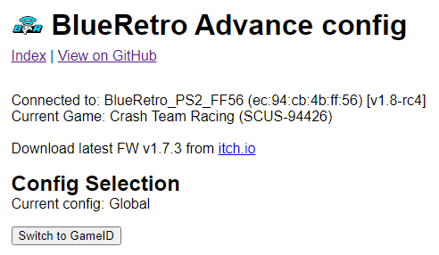
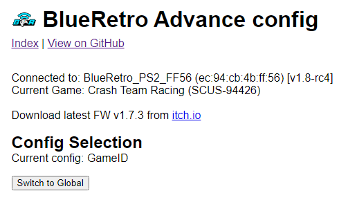
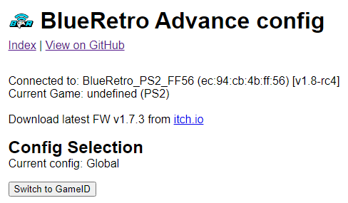
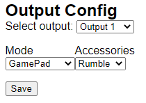
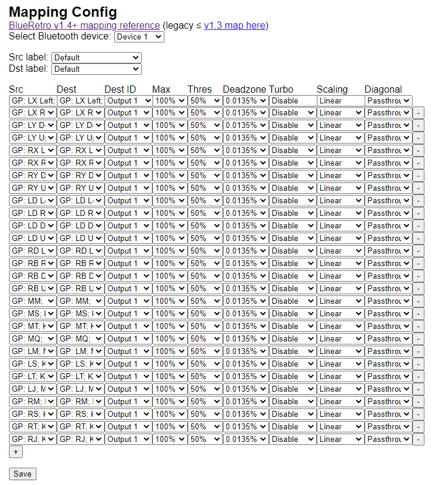
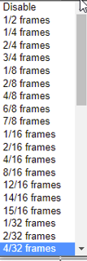
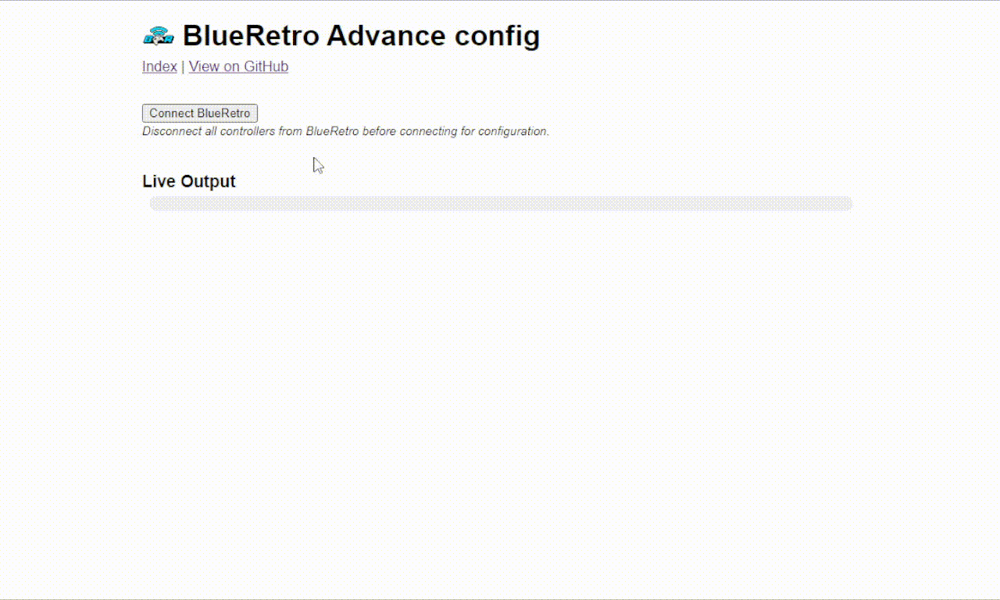
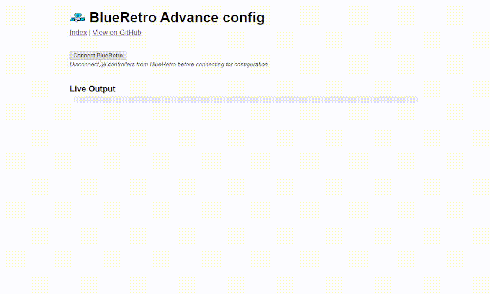

# Table of contents

* [Introduction](#1---introduction)
* [Advance config page](#2---advance-config-page)
* [Presets page](#3---presets-page)
* [System manager page](#4---system-manager-page)
* [OTA FW update page](#5---ota-fw-update-page)
* [Files Manager page](#6---files-manager-page)
* [N64 controller pak manager page](#7---n64-controller-pak-manager-page)

# 1 - Introduction

BlueRetro configuration is all done via various small web pages that use the
Web Bluetooth API to connect localy to your BlueRetro device over Bluetooth
Low Energy (BLE). Nothing need to be installed beside having a Google Chrome
based browser.

* [Advance config](https://blueretro.io/advance.html): The main configuration page were
  you can configure what type of accessories BlueRetro will emulate and define custom
  axes/buttons mapping for each player.
* [Presets config](https://blueretro.io/presets.html): This page allow to load predefined
  controller axes/buttons mapping.
* [System manager](https://blueretro.io/system.html): This page let you reboot, put to
  sleep or factory reset your BlueRetro device.
* [OTA FW update](https://blueretro.io/ota.html): This page let you update your BlueRetro
  device firmware wirelessly.
* [Files Manager](https://blueretro.io/files.html): This page let you delete files from
  the BlueRetro file system.
* [N64 controller pak manager](https://blueretro.io/n64_ctrlpak.html): This page let you
  manage N64 controller pak data.

# 2 - Advance config page

## 2.1 - Config Selection

Config selection allow you to have different active config base on the GameID sent by a
supported game loader.

### 2.1.1 - Limitation

First BlueRetro got a limit of 16 files on it's file system. This isn't related to space on the
partition but rather due to the heavy usage of RAM the filesystem consume when the maximum files
count is high.

BlueRetro got 4 system files to begin with so this leave space for a **maximum of 12 extra configs
for GameID.**

### 2.1.2 - How to switch a Game to it's own config

1. Using a loader that support GameId (Xstation, EverDrive, Swiss-GC) start the game than
   disconnect every bluetooth device from BlueRetro.
2. Connect to either the Advance config or Presets page at https://blueretro.io/
3. Once connected the current active Game name will be displayed:\
   
4. Click on Switch to GameID button
5. Now every times this game is active this config will be loaded automatically and any change
   will be saved in that file.\
   

### 2.1.3 - Per console type config
For the universal version of BlueRetro the GameID framework can be reused to save different default
config for different system. Simply boot BlueRetro on the system you want to set a new default and
follow the same instruction as above.

The game name will be undefined but the GameID will be the console name.

## 2.2 - Global config

Change to the Global config require to reboot the BlueRetro device to take effect.

* **System**: (Default: Auto) This option let you override the system type BlueRetro emulate
  controller for.
* **Multitap**: (Default: None) This let you select the multitap configuration.\
  See [System Specific Web Config User Manual](BlueRetro-System-Specific-User-Manual)
  detail about options supported for each system.
* **Inquiry mode**: (Default: Auto) This let you set if BlueRetro goes automatically into pairing
  mode if no controller are present. If manual is selected you need to enable pairing mode via
  the BOOT (IO0) button.
* **Memory Card Bank**: (Default: Bank 1) This only for N64, it let you select which bank is used
  for player 1. Player 2-3 banks selection cascade base on this selection.

## 2.3 - Output config

The **Select ouput** dropbox let you select the active wired output for which the setting will be
saved to. You need to save for each modified output setting.

See [System Specific Web Config User Manual](BlueRetro-System-Specific-User-Manual)
detail about options supported for each system.

* Mode: (Default: GamePad) This let you choose which type of peripheral is emulated by BlueRetro.
* Accessories: (Default: None) This let you select which type of controller slot accessories is
  emulated by BlueRetro.

## 2.4 - Mapping config

Up to 128 mapping can be added. Simply click on +/- buttons to add or remove a mapping. The label
used by default are quite generic. You can use the **Src label** and **Dst label** to select the
actual controller type you are currently mapping from and to. The labels selection is only to help
you and has no effect on the config at all. You can also consult the [mapping reference chart](https://docs.google.com/spreadsheets/d/e/2PACX-1vT9rPK2__komCjELFpf0UYz0cMWwvhAXgAU7C9nnwtgEaivjsh0q0xeCEiZAMA-paMrneePV7IqdX48/pubhtml).

The **Select Bluetooth device** dropbox let you select the active Bluetooth input for which the
setting will be saved to. You need to save for each modified device mapping setting.

For each mapping you can configure various options which might or not be used base on what the source and destination end up to be a button or an axis and vice versa.

**If all you want to do is a simple button remapping, all you need to touch is the src and dest colums, leave everything else to default value.**

* **Src**: This is the source button/axis on the Bluetooth controller
* **Dest**: This is the destination button/axis on the wired interface.
* **Dest ID**: This is the ID of the wired interface.
* **Max**: If source & destination is an axis then this is the scaling factor base on the
  destination maximum.\
  If source is a button & destination is an axis then this is the value base on
  destination maximum that the axis will be set.
* **Threshold**: If source is an axis and destination is a button, this is the threshold
  requires on the source axis before the button is pressed.
* **Deadzone**: This is the axis dead zone around reset value.
* **Turbo**: Turbo function base on the system frame rate.
* **Scaling**: Various response curve for scaling. (Only Passthrough and Linear available,
  others not yet implemented)
* **Diagonal**: (Not yet implemented) ~~Diagonal scaling options between joystick type.~~

### 2.4.1 - Turbo / Autofire

BlueRetro turbo feature is probably one of the most over-engineered one around. You got 50 possible
options. Not only you can choose the rate but you can also select the duty cycle.

The rate is base on the console controller polling rate which is most of the time 60hz.
Using for example "1/2 frames" give a button pulsing at 30Hz, one frame it's pressed and it's
unpressed for 1. "2/4 frames" give a button pulsing at 15Hz, 2 frames on, 2 frames off. etc..

As I said you can select the duty cycle. "1/4 frames" still give a button pulsing at 15Hz but it's 1 frames on and 3 frames off. This allow to tweak your turbo to work well in any game.

A lot of games filter out buttons press that are only 1 frames long, so often the "1/X frames" look
like they do nothing.

For example on PC-Engine/TG16 original controller the slow turbo is the equivalent of "4/8 frames"
and the fast one is "2/4 frames".

You can also set the turbo on a axis, in that case the axis will toggle between it's neutral value
(off) and it's current position (on).

You can map the same buttons multiple time with different turbo settings aswell.

## 2.5 - Example buttons mapping

In this example the button X & B from an Xbox One controller are remapped to their name equivalent
on a GameCube controller. (The default mapping is base on equivalent positioning)

## 2.6 - Example enable rumble

In this example the player 1 rumble is enabled.

# 3 - Presets page

Presets are predefined button mapping for a specific game or game type. They are JSON files located on the server that the client list via GitHub API. A user could simply fork the page on GitHub and upload its own presets.

# 4 - System manager page

# 5 - OTA FW update page

# 6 - Files Manager page

I added a new page to allow removing the configs once you reach the limit:
https://darthcloud.github.io/BlueRetroWebCfg_Beta/files.html

By default their is only 4 default files. Those files are re-created automatically at boot if missing.
config.bin is the default config.

Once you got a few config it will look like this:

The file name will be base on the RAW GameId value, place the cursor over the file name to make an info box appear with the actual Game name.

# 7 - N64 controller pak manager page
