# Table of contents
* [Game Boy Advance](#game-boy-advance)
* [Virtual Boy](#virtual-boy)

# Game Boy Advance

I'm replacing the SEA board arduino firmnware with BlueRetro! FPGA bitstream is now
included within BlueRetro SPIFFS partition (no more SD required!!) and at boot
BlueRetro will program the FPGA with the GBAHD bitstream. Pass that point GBAHD & BlueRetro
operate independently. GBAHD handle audio & video while BlueRetro handle the inputs.

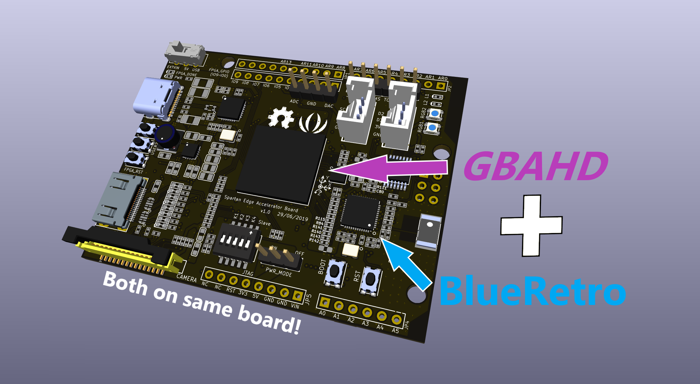

No need for a separate board for control anymore, everything you need is on the SEA board!

GBAHD OSD is controlled via BlueRetro aswell, it is mapped by default to the "Home" buttons (3rd center buttons)
of modern Bluetooth controller.

## Bill of materials
* Seeed Spartan Edge Accelerator Board (DKPN: 1597-102030005-ND PN: 102030005)
* Black project box (DKPN: SR071B-ND PN: 071,BK)
* SODERON 155 magnet wire 29 AWG
* Barrel jack 5.5mm/2.1mm (DKPN: 839-1291-ND PN: 54-00063)
* 1N5400 diode (DKPN: 1N5400RLGOSCT-ND PN: 1N5400RLG)
* 9V PSU 5.5mm/2.1mm center positive (DKPN: 993-1344-ND PN: PSAC30U-090L6)
* SPST momemtary switch (x2) (DKPN: EG2041-ND PN: PS1057ABLK)
* SPST w/ LED (DKPN: 401-1298-ND PN: DA102J5RS215QF6)
* 150 ohm resistor (DKPN: S150CACT-ND PN: RNMF14FTC150R)
* Short mini-HDMI plug to HDMI socket adapter 
* Seeed Grove connector cables (DKPN: 1597-1089-ND PN: 110990027)

## Building instructions

### Step 0: Prepare the case
I won't go into detail for this step.
Either:
* Buy an existing GBA consolized case
* 3D print one yourself
* Make your own using a generic project box (I did that)

### Step 1: Remove componant from GBA
Assuming you already took apart your GBA,
either use a hot air rework station or use chip quick to desolder with iron the following parts:
* X1 crystal
* (Optional) Remove L & R buttons
* (Optional) Remove battery terminals
* (Optional) Remove TRS audio connector

### Step 2: Programming SEA board
1. Download latest [BlueRetro firmware](https://github.com/darthcloud/BlueRetro/releases) and unzip.
   Download latest [GBAHD bin for BlueRetro](https://github.com/darthcloud/gbaHD/releases).
   Download the [ESP32 Flash Download Tools](https://www.espressif.com/en/support/download/other-tools) and unzip.
2. Connect SEA board with USB and execute flash_download_tool_x.y.z.exe
3. Set chipType: ESP32, workMode: develop and click OK\

4. Select and checkbox the 3 BlueRetro binary files in the first 3 field, the GBAHD one in the 4th and match the option as in screenshot.\
   In order each bin offset are: 0x1000, 0x8000, 0x10000 & 0x310000.\
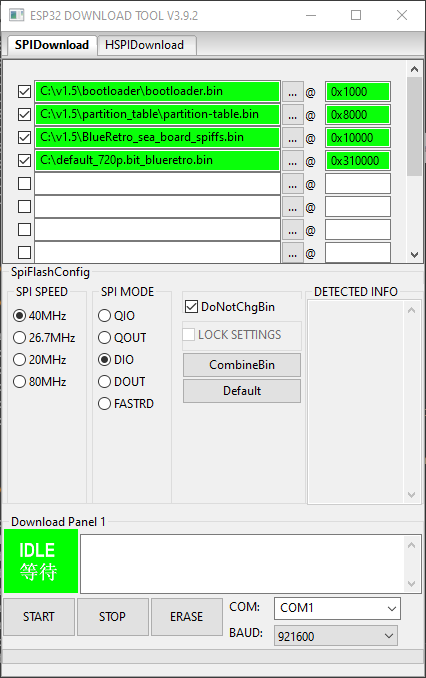
6. Select proper COM port for your machine.
7. Press START
8. Wait for status to change to FINISH.

### Step 3: Reworking SEA board ESP32 IOs
1. Remove component mark in red on both sides of the SEA board.\
   You may also remove those mark in yellow to make more room to solder wires later.\
[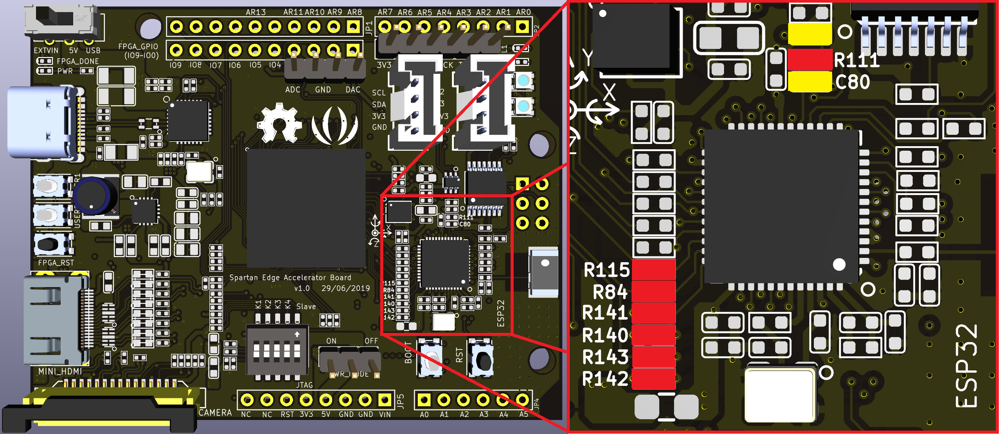](img/gbahd/sea_front_rm.png)
[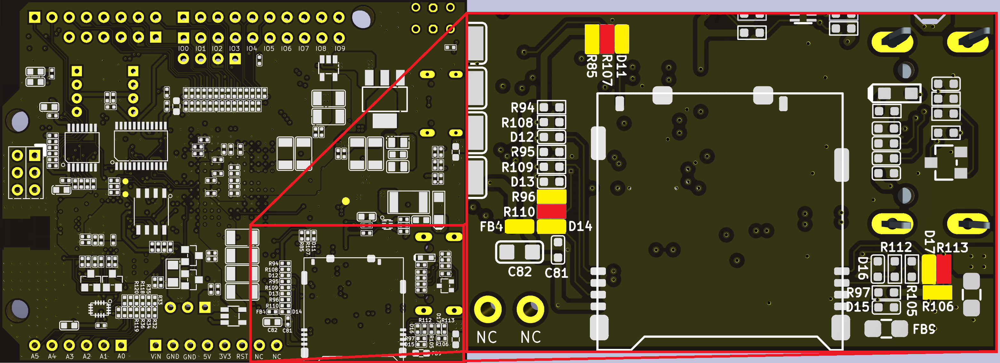](img/gbahd/sea_back_rm.png)

2. Short the jumper on back side with wire as shown with red mark to bring 3.3V to the power header 3.3V pin.\
[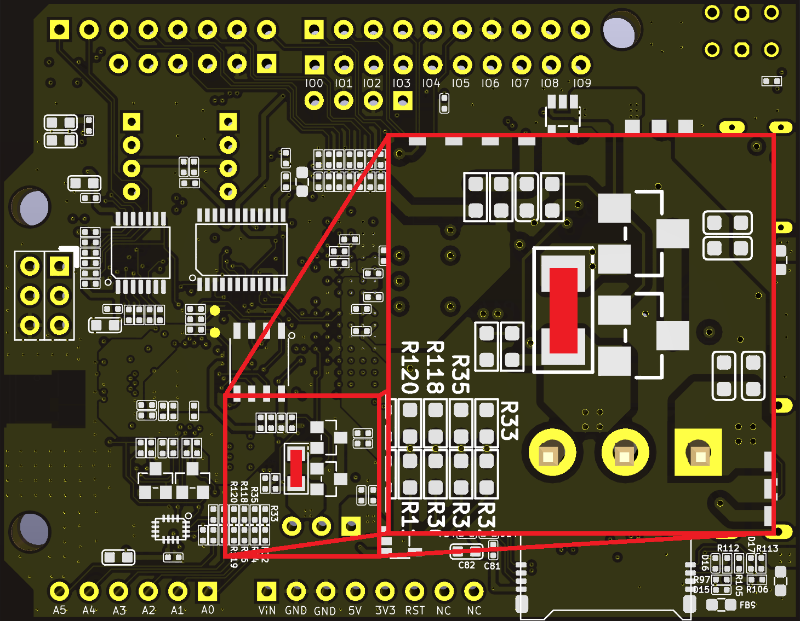](img/gbahd/sea_back_jumper.png)

3. Wire the 3 unused header pads to signals previously used for SD card.\
   This make those signal accessible from the top side, which is easier.\
[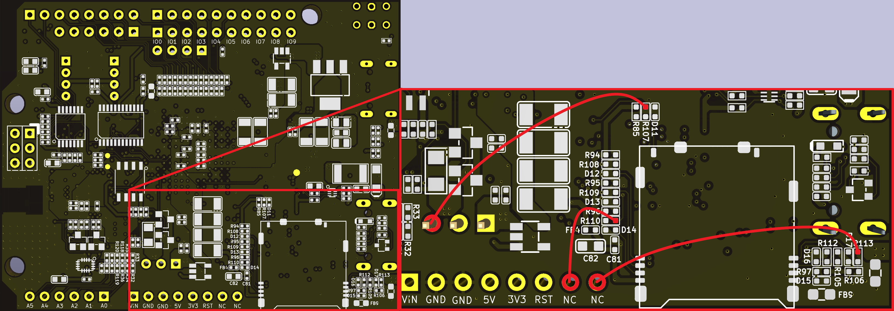](img/gbahd/sea_back_reroute.png)

### Step 4: Wiring FPGA to GBA
1. First wire up the LCD to FPGA.
**Note that the LCD pad # are not marked on the GBA PCB.**

[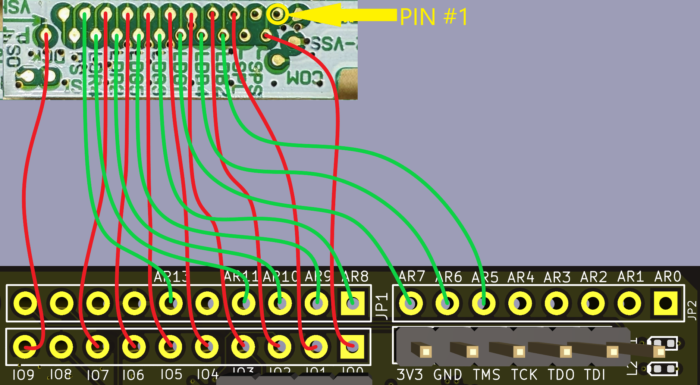](img/gbahd/gba_lcd_fpga_wire.png)

**FPGA Pin** | **GBA LCD PAD** | GBA LCD 40-pin | GBA LCD 32-Pin | GBA SP 34-Pin
-|-|-|-|-
IO0 | 2 | 26 | 25 | 25
IO1 | 5 | 23 | 22 | 22
ARD5 | 6 | 22 | 21 | 21
IO2 | 7 | 21 | 20 | 20
ARD6 | 8 | 20 | 19 | 19
IO3 | 9 | 19 | 18 | 18
ARD7 | 10 | 17 | 16 | 16
IO4 | 11 | 16 | 15 | 15
ARD8 | 12 | 15 | 14 | 14
IO5 | 13 | 14 | 13 | 13
ARD9 | 14 | 13 | 12 | 12
IO6 | 15 | 12 | 11 | 11
ARD10 | 16 | 11 | 10 | 10
IO7 | 17 | 10 | 9 | 9
ARD11 | 18 | 9 | 8 | 8
ARD13 | 19 | 8 | 7 | 7
IO9 | 22 | 3 | 2 | 2

2. Then the audio.

[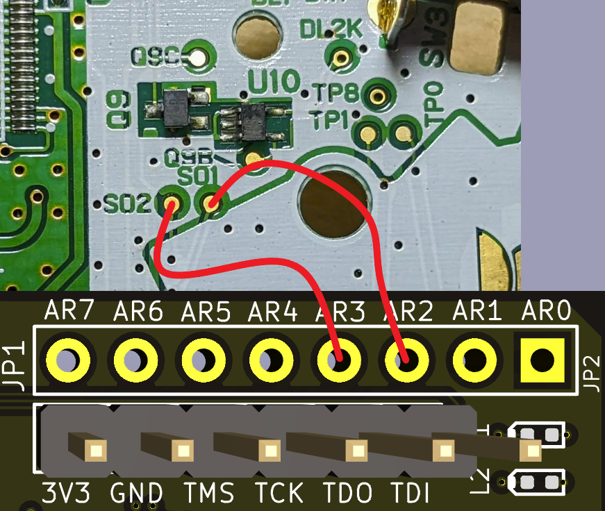](img/gbahd/gba_audio_fpga_wire.png)

GBA Test Point | FPGA Pin
-------------- | ---------
S01 | ARD2
S02 | ARD3

3. Finaly connect the FPGA IO8 pad to the to the GBA XTAL pad.

GBA | FPGA Pin
--- | --------
XTAL pad | IO8

### Step 5: Wiring ESP32 to GBA
Use resistor pad highlighted in RED for connection.\
Remove and discard jumper of PWR_MODE header.\
Use alternative point we wired in Step 3 for TP2, TP3 & TP9.

SEA PAD | SEA NET | ESP IO | GBA BTN | GBA TP
------- | ------- | ------ | ------- | ------
R115 | ESP_QSPI_CS | 5 | A | TP0
R141 | ESP_QSPI_D | 23 | B | TP1
R113 | SDCARD_D1 | 4 | SELECT | TP2
R107 | SDCARD_CD | 16 | START | TP3
R142 | ESP_QSPI_HD | 21 | RIGHT | TP4
R84 | ESP_QSPI_CLK | 18 | LEFT | TP5
R140 | ESP_QSPI_Q | 19 | UP | TP6
R143 | ESP_QSPI_WP | 22 | DOWN | TP7
R111 | SDCARD_CCLK | 14 | R | TP8
R110 | SDCARD_CMD | 15 | L | TP9

### Step 6: Wiring power

[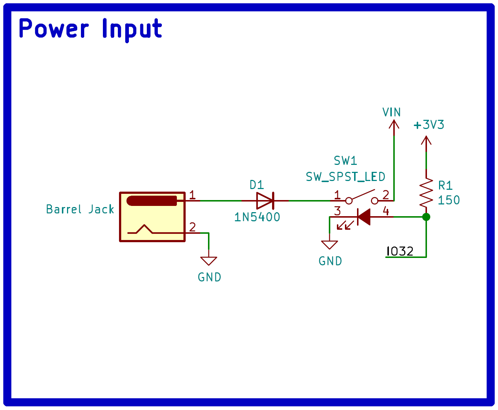](img/gbahd/power_schem.png)

[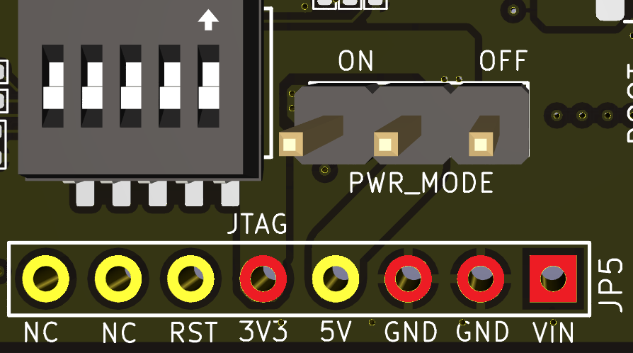](img/gbahd/power_header.png)

1. Solder 1N5400 anode to barrel jack inner pin.
2. Connect one of the power switch pin to the 1N5400 diode cathode.
2. Connect the other power switch pin to the VIN pad of the SEA board power header (JP5).
2. Connect GND pin on SEA board power header (JP5) to barrel jack outer pin.
4. Connect GND pin on SEA board power header (JP5) to GBA "-" battery terminal.
5. Connect 3V3 pin on SEA board power header (JP5) to GBA "+" battery terminal.

### Step 6: Wiring FPGA OSD COM, ESP32 LED & Boot button

1. Connect the Seeed Grove cable to SEA board connector with the SCL/SDA labels.
2. Cut-off the other end of the Seeed Grove cable.
3. Wire the Yellow wire (Pin 1: ESP IO33) to the FPGA pin ARD4 for OSD COM.
4. Wire the White wire (Pin 2: ESP IO32) to the power switch LED anode.
5. Solder the 150 ohm resistor to the power switch LED anode aswell.
6. Solder the Grove cable Red wire (Pin 3) to the resistor other end.
7. Solder the Grove cable Black wire (Pin 4) to the power switch LED cathode.
8. Wire one of the momentary switch pin to GND.
9. Wire the other momentary switch pin to the Boot switch pin as circle in red.

### Step 7: Set SEA board switches

[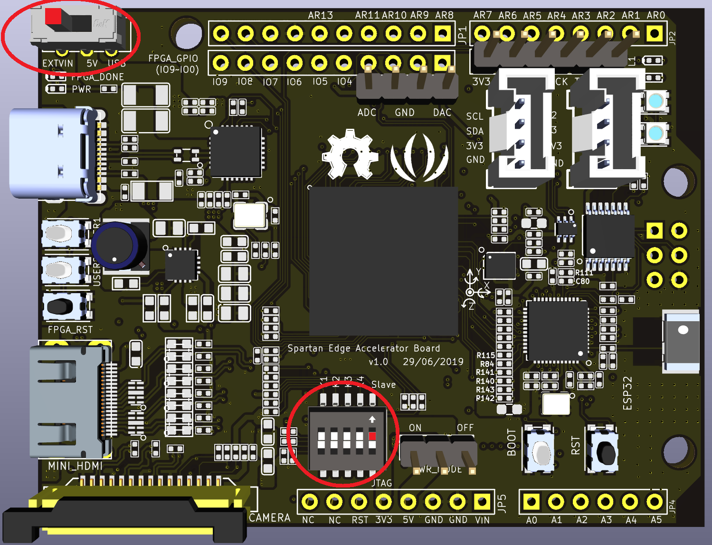](img/gbahd/sea_front_sw.png)

1. Set the power switch into the EXTVIN position.
2. Set the DIP switch 5th bit into the Slave position.

### Step 8: Connection
1. Use an mini-HDMI plug to HDMI connector to ease mounting to your case.
2. Use a power supply with at least 1A with center pin positive 5.5mm/2.1mm diameter.
3. Some TV/Monitor don't like DVI with audio, so you might only get either audio or video,\
   if so try another TV/Monitor.

# Virtual Boy

I'm combining furrtek's VirtualTap and BlueRetro running on an ESP32-DevKitC board
into a gerneric translucent red project box. This allow to control the VirtualTap
with a wireless controller in addition to the Virtual Boy itself.

## Bill of materials
* VirtualTap [http://furrtek.free.fr/virtualtap/](http://furrtek.free.fr/virtualtap/)
* Servo emulator
* Red translucent box (DKPN: HM991-ND PN: 1591ETRD)
* ESP32-DEVKITC-32E (DKPN: 1965-ESP32-DEVKITC-32E-ND)
* 74AHCT125N DIP14 (x2) (DKPN: 296-4655-5-ND PN: SN74AHCT125N)
* TRS connector (DKPN: 839-1411-ND PN: 54-00081)
* TRS cable (DKPN: CP-2208-ND PN: CA-2208)
* Barrel jack 5.5mm/2.1mm (DKPN: 839-1291-ND PN: 54-00063)
* 1N5400 diode (DKPN: 1N5400RLGOSCT-ND PN: 1N5400RLG)
* 9V PSU 5.5mm/2.1mm center positive (DKPN: 993-1344-ND PN: PSAC30U-090L6)
* SPST toggle switch (DKPN: EG5779-ND PN: 200MSP1T2B1M1QE)
* SPST toggle switch hexnut (DKPN: EG5503-ND PN: HDW211048UNSHEXNUT)
* SPST momemtary switch (x2) (DKPN: EG2041-ND PN: PS1057ABLK)
* SPST w/ LED (DKPN: 401-1298-ND PN: DA102J5RS215QF6)
* 150 ohm resistor (DKPN: S150CACT-ND PN: RNMF14FTC150R)
* VGA DB-15-HD (DKPN: AE11025-ND PN: A-HDF 15 LL/Z)
* VGA mounting hex screw (DKPN: 36-7231-5-ND PN: 7231-5)
* JST PH connector pin (x6) (DKPN: 455-1127-1-ND PN: SPH-002T-P0.5S)
* JST PH housing 13 pin (DKPN: 455-1155-ND PN: PHR-13)
* 28 AWG ribbon cable (DKPN: MC24M-10-ND PN: 3302/24 300SF)

## Schematic
 [https://github.com/darthcloud/BlueRetroHW/blob/master/Consolize/VirtualBoy/VirtualBoy.pdf](https://github.com/darthcloud/BlueRetroHW/blob/master/Consolize/VirtualBoy/VirtualBoy.pdf)

## Building instructions

See my youtube video time lapse for some pointer:
[https://www.youtube.com/watch?v=VbQTspncy0Y](https://www.youtube.com/watch?v=VbQTspncy0Y)
