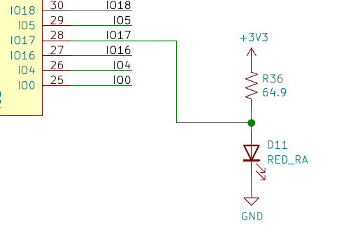

## Bill of materials
* ESP32-DEVKITC-32D or ESP32-DEVKITC-32E with ESP-WROOM-32
* DB-25 Female connector solder cup (or console plug if hardwired)

## Build instructions
1. Linux only:\
   Install [esp-idf prerequisites](https://docs.espressif.com/projects/esp-idf/en/latest/esp32/get-started/linux-setup.html).\
   
2. Download latest binary from [GitHub](https://github.com/darthcloud/BlueRetro/releases) and flash them on your ESP32.\
\
Use one of the SPIFFS binaries.\
\
  Linux:\
  `~/BlueRetroRoot/python_env/idf4.2_py3.7_env/bin/python ~/BlueRetroRoot/esp-idf/components/esptool_py/esptool/esptool.py -p /dev/ttyUSB0 -b 460800 --before default_reset --after hard_reset --chip esp32  write_flash --flash_mode dio --flash_size detect --flash_freq 40m 0x1000 bootloader.bin 0x8000 partition-table.bin 0x10000 BlueRetro.bin`\
  Windows:\
  [Flashing firmware Windows 10](https://github.com/darthcloud/BlueRetro/wiki/Flashing-firmware-Windows-10)

4. Install DB25 connector (or direct console plug).\
https://github.com/darthcloud/BlueRetroHW/blob/master/DIY/BlueRetroDIY.pdf

5. Build target system cable adapter (or use as reference for direct console plug).\
https://github.com/darthcloud/BlueRetro/wiki/BlueRetro-Cables-Build-Instructions

6. (Optional) Power on system and connect via Web Bluetooth to configure adapter.\
   The config mode is only available if no controller is connected. \
https://blueretro.io

8. BlueRetro is always in pairing mode if no controller connected (and stay in pairing mode for 1 minute after one device connected)\
   Pair via inquiry first (SYNC or pairing mode), on subsequent connection you can simply page (button press or power on button).
   See guide for more specific instruction: [Pairing Guide](https://github.com/darthcloud/BlueRetro/wiki/Controller-pairing-guide)

9. (Optional) Wire IO17 as follow to get Bluetooth pairing mode status and error notification:
   
