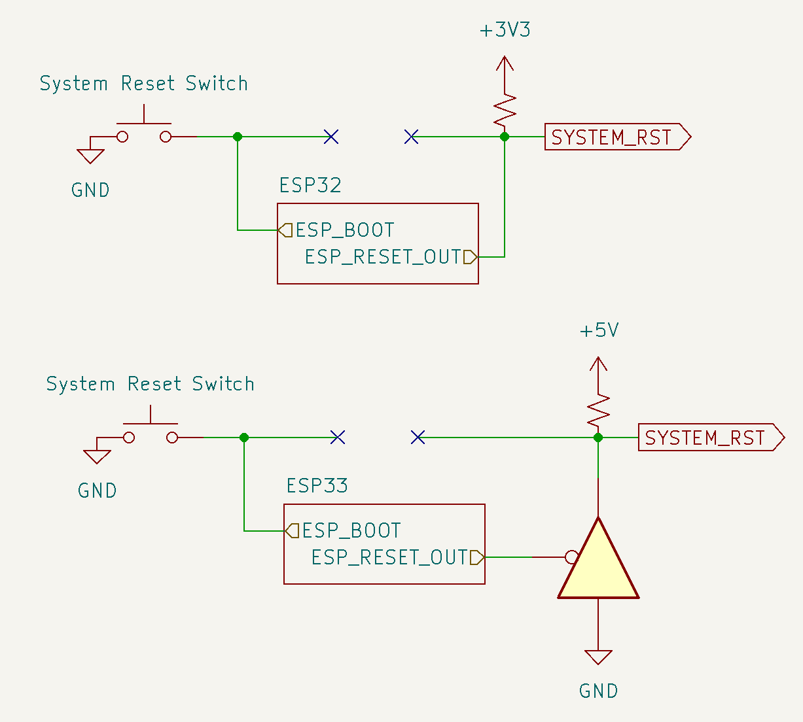
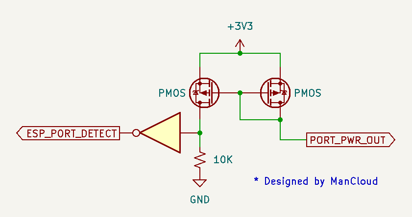
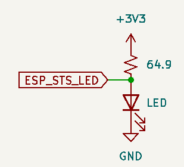

# This is not a modding guide. While all the information is listed, you need to be experienced in electronic to make use of this information.

# 0 Table of contents
* [1 ESP32 power source](#1-esp32-power-source)
* [2 Power switch & relay](#2-power-switch--relay)
* [3 Reset button](#3-reset-button)
* [4 Console power detection](#4-console-power-detection)
* [5 Controller port detection](#5-controller-port-detection)
* [6 Port status LED](#6-port-status-led)
* [7 Global status LED](#7-global-status-led)
* [8 System specific specification](#8-system-specific-specification)

# 1 ESP32 power source
The ESP32 needs to be always ON to be able to power up the system on Bluetooth connection.

### Option 1: System with DC input
* Simply power the ESP LDO directly from the DC input.

### Option 2: System with AC input
* Use a circuit similar to a USB wall adapter to get a 5V source.
* Replacing system PSU with one who use a DC input.

# 2 Power switch & relay
ESP32 IO | Direction | Function | Note
---------- | ---------- | --------- | ------
13 | Output | Relay Set / Power set | Idle low, set high 20ms
16 | Output | Relay Unset | Idle low, set high 20ms

Use a dual coil latching relay.
Multiple relays or a relay with multi pole might be required for system with more than one supply voltage.

### Option 1: Relay wired in series
The relay is wired in series after the system power switch.

Pro:
* It's is possible for the user to completely turn off console, including the ESP32.

Con:
* The power switch now become a "hard" power switch. The reset button is now used as a "soft" power switch.

### Option 2: Relay wired in parallel
The relay is wired in parallel with the system power switch.

Pro:
* Power switch can be used as usual in addition to powering via the relay (BT connect or reset switch)

Con:
* Turning off the ESP32 require pulling the power cord.

### Option 3: Logic signal
Only possible for system where power on is controlled by a logic digital signal. Only IO13 is used in this case.

# 3 Reset button
ESP32 IO | Direction | Function | Note
---------- | ---------- | --------- | ------
0 | Input | ESP32 boot button | Idle high
14 | Output | System reset | polarity varies base on system

In an internal install, the ESP32 boot button take over the system physical reset switch.
The original system reset signal is managed by the ESP32.

### System reset behavior while ESP32 off & system off
* Holding system reset and then powering system put the ESP32 in boot (download) mode. Effectively disabling it for the current power session.

### System reset behavior while ESP32 on & system off
* System is powered on via power relay / power pin

### System reset behavior while ESP32 on and system on
* Button press under < 3 sec (All LEDs solid):
  Usual system reset.
* Button press between > 3 sec and < 6 sec (All LEDs blink slowly):
  If in pairing mode: Stop pairing mode otherwise all BT devices are disconnect.
* Button press between > 6 sec and < 10 sec (All LEDs blink fast):
  Start pairing mode.
* Button press over > 10 sec (All LEDs blink very fast):
  Factory reset ESP32 to original BlueRetro firmware the device shipped with & reset configuration.

### System reset behavior while ESP32 off and system on
* While the ESP32 is in boot mode or in deep sleep the system reset function is lost.

# 4 Console power detection
ESP32 IO | Direction | Function | Note
---------- | ---------- | --------- | ------
39 (VN) | Input | System power detection | 3.3v level

Connected directly to system 3.3v power rail.

For 5V system use a voltage divider:

# 5 Controller port detection
ESP32 IO | Direction | Function | Note
---------- | ---------- | --------- | ------
35 | Input | Controller port 1 detect | 3.3v level, low: port used, high: port free
36 | Input | Controller port 2 detect | 3.3v level, low: port used, high: port free
32 | Input | Controller port 3 detect | 3.3v level, low: port used, high: port free
33 | Input | Controller port 4 detect | 3.3v level, low: port used, high: port free

To avoid original wired controller and BlueRetro from interfering each other on the controller bus some sort of mechanism need to be used to drive the corresponding port detection pin.

### Option 1: Use existing system controller detection pin
Only for Wii extension based system like NES & SNES classic

### Option 2: Use port shield
For system with port using a shield: GameCube

This require isolating each port shield from the system GND and connecting each port shield to the corresponding detect pin on the ESP32. Each pin need a 10K pull-up resistor as well.

### Option 3: Add switch inside port
Mainly for system with big plastic connector: N64

Drill small hole in each connector outer edge receptacle and attach a SPST switch to it in a way that the controller plug close it once fully inserted. Connect one of the switch pin to GND and the other to the corresponding detection pin. Each pin need a 10K pull-up resistor as well.

### Option 4: Use a current mirror
The current mirror circuit allow to detect connected wired controller by measuring current draw from the port.
Good for any system which controller draw at least 1mA.

This require isolating the power pin of the connector and placing the current mirror circuit between the port and system power rail.

 

# 6 Port status LED
ESP32 IO | Direction | Function | Note
---------- | ---------- | --------- | ------
2 | Output | Controller port 1 LED | 3.3v level
4 | Output | Controller port 2 LED | 3.3v level
12 | Output | Controller port 3 LED | 3.3v level
15 | Output | Controller port 4 LED | 3.3v level

All those pin are ESP32 strapping pin. Interface via MOSFET to avoid problem at boot.

### Behavior while in pairing mode
* The first available port LED will be pulsing.

### Behavior when BT controller connected
* Port which got an active BT connection will have it's corresponding LED solid.

### Behavior while system reset is pressed (Boot button)
* All port LED are used to indicate current switch function (See [3](#system-reset-behavior-while-esp32-on-and-system-on))

# 7 Global status LED
ESP32 IO | Direction | Function | Note
---------- | ---------- | --------- | ------
17 | Output | BlueRetro status LED | 3.3v level

### Behavior while in pairing mode
* LED will be pulsing.

### Behavior while system reset is pressed (Boot button)
* LED indicate current switch function (See [3](#system-reset-behavior-while-esp32-on-and-system-on))

### Behavior when an unrecoverable error occur
* LED will be solid.

# 8 System specific specification
System specific specification take precedence over the preceding global specification

### GameCube
ESP32 IO | Direction | Function | Note
---------- | ---------- | --------- | ------
19 | Both | Player 1 DATA | 
5 | Both | Player 2 DATA | 
26 | Both | Player 3 DATA | 
27 | Both | Player 4 DATA | 

* 1 ESP32 power source: Use option 1
* 2 Power switch & relay: Use option 1 or 2
* 5 Controller port detection: Use option 2

### (S)NES Mini Classic

### Others
No other system is supported for internal install at this time.