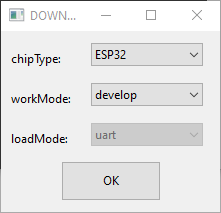
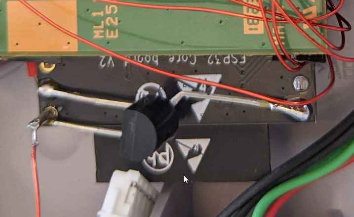
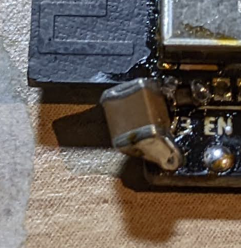
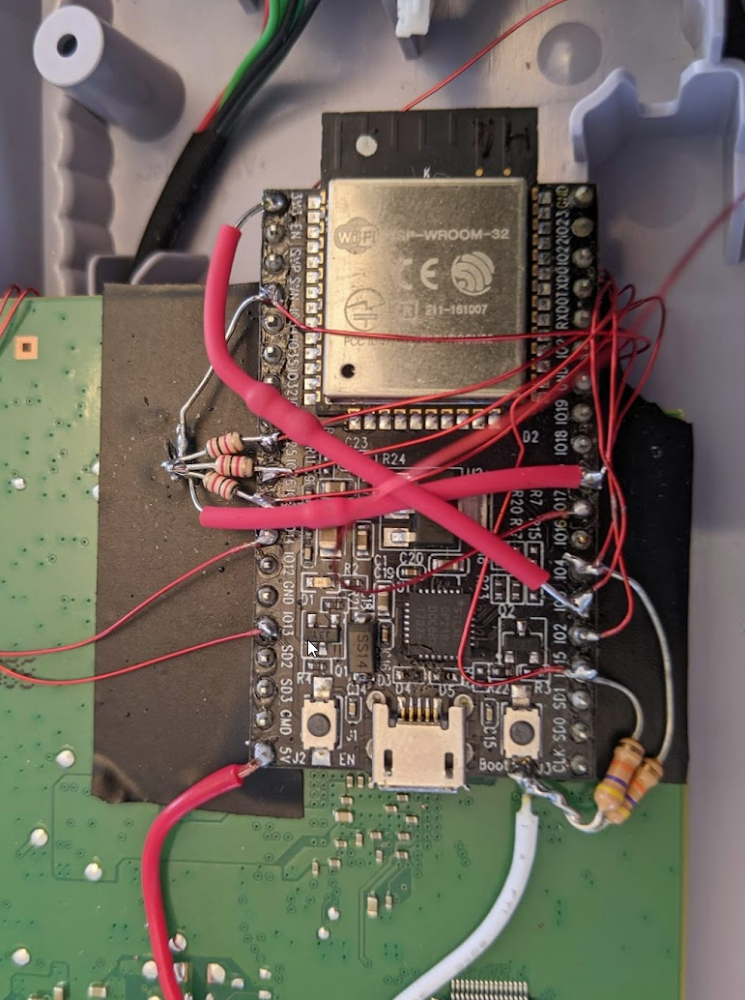
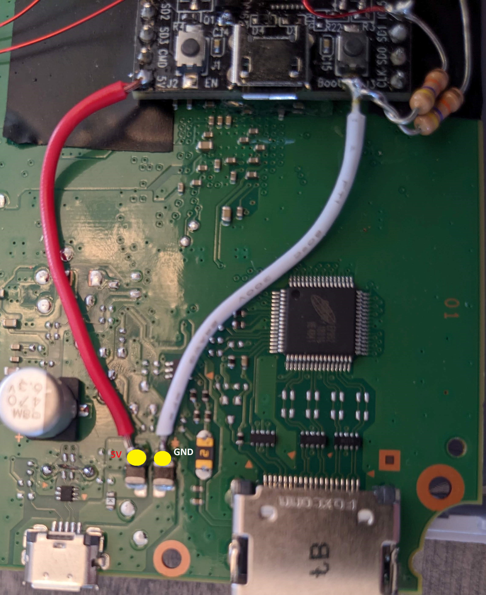

# **Original Kernel is supported ONLY. A glitch create random button press when using Hakchi2 CE kernel. No idea why!**

# Table of contents
* [Intro](#intro)
* [Bill of materials](#bill-of-materials)
* [Install instructions](#install-instructions)

# Intro
This instructions will show you how to install BlueRetro within your SNES mini.
Special perk in doing so are the ability to power on/off & reset the console from the
the Bluetooth controllers. Ability to use the wired controller is retained and is detected
at any time.

Famicom & NES mini should be supported as well, the technical aspect is the same exept the
point on PCB are likely different. I do not own either so I can't provided pictures myself.

Unfortunately this doesn't work with the Hakchi CE kernel. For some reason random buttons
press glitch appear when using that kernel. I debugged this for a week and couldn't figure it out...

# Bill of materials
* ESP32-DEVKITC-32E with ESP-WROOM-32 (Get it on [Digikey](https://www.digikey.com/en/products/detail/espressif-systems/ESP32-DEVKITC-32E/12091810?s=N4IgTCBcDaIKYGcAOBmMBaAJnAbgawEsAXAY3TThAF0BfIA) or [Mouser](https://www.mouser.com/ProductDetail/Espressif-Systems/ESP32-DevKitC-32E?qs=sGAEpiMZZMv0NwlthflBi3XYxq%252BTapwyHnR2%2FrAf4bY%3D))
* 150 ohm resistor (x1) (DKPN: S150CACT-ND PN: RNMF14FTC150R)
* PMIC Supervisors (x1) (DKPN: DS1233A-10+T&R PN: DS1233A-10+T&RCT-ND)
* 100uF capacitor (x1) (DKPN: 1276-3399-2-ND PN: CL32X107MQVNNNE)
* 1uF capacitor (x1) (DKPN: 587-1241-2-ND PN: EMK107B7105KA-T)
* Green LED (x1) (DKPN: 160-1130-ND PN: LTL-4233)
* 2K resistor (x4) (DKPN: CF14JT2K00CT-ND PN: CF14JT2K00)
* 47K resistor (x2) (DKPN: CF14JT47K0CT-ND PN: CF14JT47K0)

# Install instructions

## Step 1: Remove componant from the board
Assuming you already took apart your SNES mini,
either use a hot air rework station or use chip quick to desolder with iron to remove
the two resistors highlighted in RED near the controllers connectors.

## Step 2: Programming ESP32 DevKit-C board
1. Download latest [BlueRetro firmware](https://github.com/darthcloud/BlueRetro/releases) and unzip.
   Download the [ESP32 Flash Download Tools](https://www.espressif.com/en/support/download/other-tools) and unzip.
2. Connect DevKit-C board with USB and execute flash_download_tool_x.y.z.exe
3. Set chipType: ESP32, workMode: develop and click OK\
   
4. Select and checkbox the 3 BlueRetro binary files in the first 3 field.\
   In order each bin offset are: 0x1000, 0x8000 & 0x10000.\
   Take firmware file called: BlueRetro_wii_ext_internal.bin\
   
6. Select proper COM port for your machine.
7. Press START
8. Wait for status to change to FINISH.

## Step 3: Add PMIC supervisor to DevKit-C board
Some of the pin used in this mod are ESP32 strapping, so we need to use a PMIC supervisor
to hold the ESP32 in reset for some time when power cord get connected. We also improve
the decoupling of the ESP32 module to avoid current draw spike to lower the voltage below
the PMIC threshold.

1. Remove the header from the DevKit-C by cutting them.

2. Install PMIC on ESP32 back with pin on 3V3, pin on GND and pin on EN.\
   \
   

2. Install 1uF cap between pin 1 & 2 of the ESP32 module.

3. Install 100uF cap between pin 1 & header 3V3 pin of the ESP32 module.\
   

## Step 4: Wiring DevKit-C to SNES mini PCB
1. Mount the ESP32 on the back of the SNES mini PCB with double sided tape
   

2. Wire up the ESP32 to PCB point.\
   **Note that the PCB point # are not marked on the SNES mini PCB.**

   

   **ESP32 IO** | **SNES mini point** | Description
   -|-|-
   IO14 | 1 | Reset button
   IO13 | 2 | Power button
   IO26 | 3 | P1 SDA
   IO25 | 4 | P1 SCL
   IO4 | 5 | P1 Detect from CTRL
   IO39 | 6 | P1 Power (ON state sense)
   IO2 | 7 | P1 Detect to mini
   IO2 | 8 | P2 Detect to mini
   IO27 | 9 | P2 SDA
   IO5 | A | P2 SCL
   IO15 | B | P2 Detect from CTRL

3. Wire up the ESP32 power supply.\
   

4. Add I2C 2K pull-up resistor to ESP 3V3 to ESP32 pin IO5, IO25, IO26 & IO27.

5. Add detect input 47K pull-down resistors on ESP32 pin IO4 & IO15.

## Install status LED
1. Drill a small hole to route the LED under the diffuser.\
   

2. Install LED under and secure it with hot glue.

3. Wire the LED to ESP32. Use 150 Ohm for resistor (unlike schematic).\
   

   
